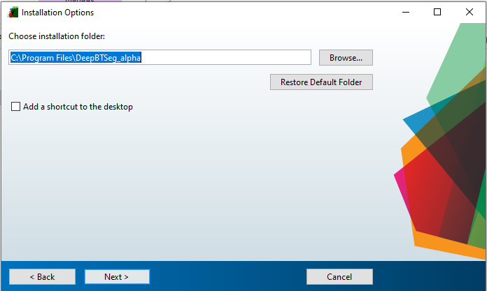
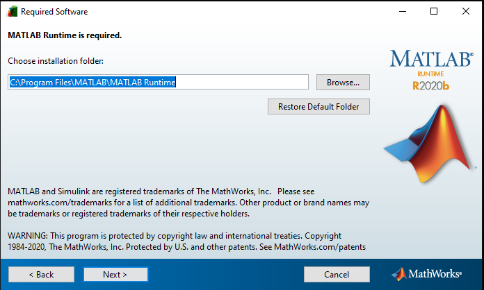
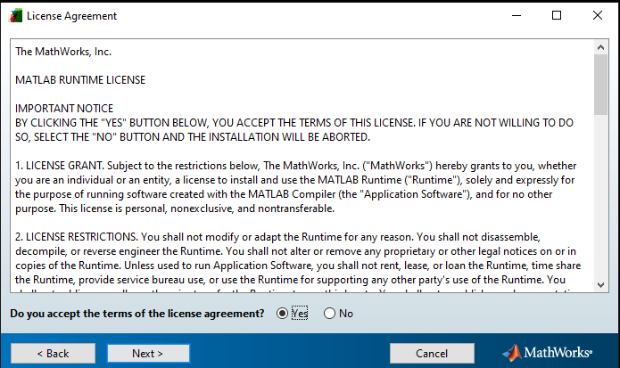
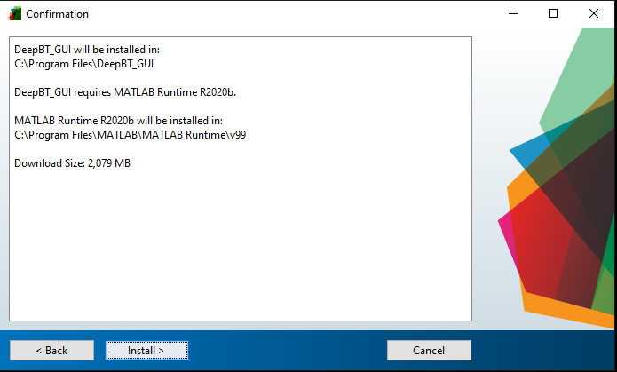
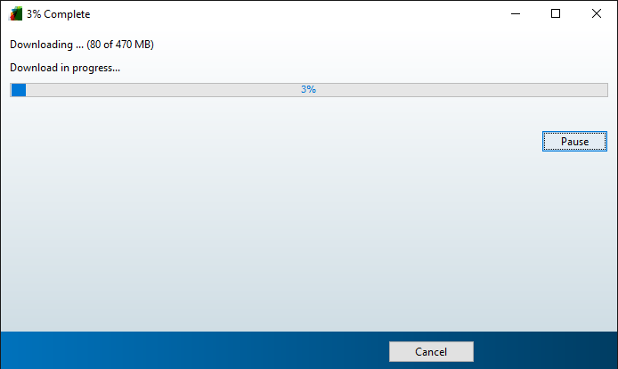

# DeepBTSeg-executable

DeepBTSeg provides the user-friendly graphical user interface (GUI) of remote deep learning models of brain tumors, which allow users to conduct deep learning image brain tumor segmentation without the cumbersome of both software and hardware requirements on their local computers. 

This repository is the client end executable version of DeepBTSeg. We also provide Matlab code of DeepBTSeg [here].
DeepBTSeg is developed under Matlab 2020b and is executable under Matlab 2019b and Matlab 2020a.

# Installation

Dowload DeepBTSeg repository and unzip it.
Double click DeepBTSeg.exe

Click "Next"

Click "Next"

Click "Next"

Select "Yes" and "Next"

Click "install"

# User instructions
1.make sure the current folder of Matlab is under DeepBTSeg.

2.Run DeepBT_GUI.m under the DeepBT folder in matlab.

3.Click "Load images" button to select the directory of DICOM images.

4.Using the checklist on the left of the DICOM_selection_GUI window to specify the T1, T1 post, FLAIR, and T2 images.

5.Click “Submit this job” to transmit this job to the server for processing or click “Submit for all models” to apply all models on the current image series.

6.Click "Check job" under the action menu or "Update status for all jobs" button to refresh the job status and messages from the remote server, which shown in matlab command window..

7.Click "Export results" under the action menu to save processing results as DICOM RTSS file  when the job status is "Completed". Make sure you export results before you close DeepBT  because non-save results will be automatically eliminated.
