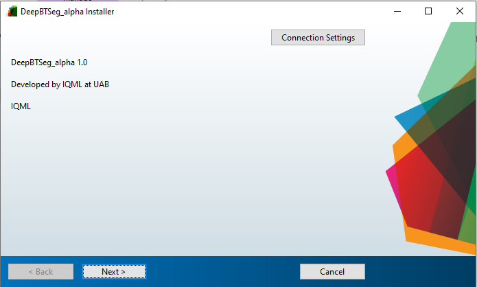
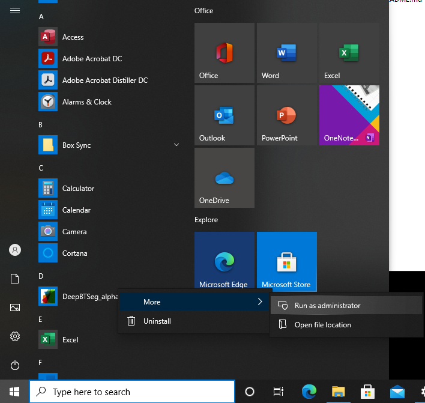

# DeepBTSeg-executable

DeepBTSeg provides the user-friendly graphical user interface (GUI) of remote deep learning models of brain tumors, which allow users to conduct deep learning image brain tumor segmentation without the cumbersome of both software and hardware requirements on their local computers. 

This repository is the client end executable version of DeepBTSeg. We also provide Matlab code of DeepBTSeg [here](https://github.com/IQMLatUAB/DeepBTSeg).
DeepBTSeg is developed under Matlab 2020b and is executable under Matlab 2019b and Matlab 2020a.

# Installation
* Window version (developed under Matlab 2020b)

Dowload DeepBTSeg repository and unzip it.
Double click DeepBTSeg.exe

Click "Next"

Click "Next"

Click "Next"

Select "Yes" and "Next"

Click "install"

Installation completed

# User instructions
1.!!!Really Important!!!

Right click and choose "run as administrator" all the time(even you log in as administrator in your computer)

2.Click "Load images" button to select the directory of DICOM images.

3.Using the checklist on the left of the DICOM_selection_GUI window to specify the pre-contrast T1, post-contrast T1, FLAIR, and T2 images.

4.Click “Submit this job” to transmit this job to the server for processing or click “Submit for all models” to apply all models on the current image series.

5..Click “Submit job for selected model” to transmit this job to the server for processing or click “Submit jobs for all models” to apply all models on the current DICOM image series.

6.Click "Export results" under the action menu to save processing results as DICOM RTSS file  when the job status is "Completed". Make sure you export results before you close DeepBTSeg because non-save results will be automatically eliminated.
